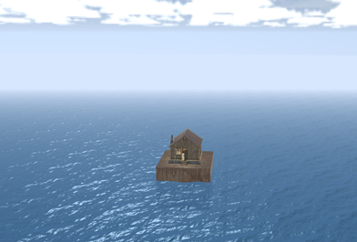
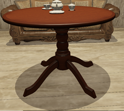
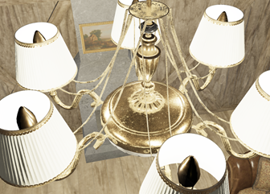
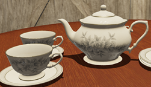
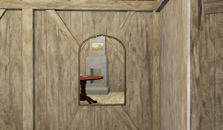
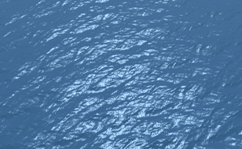

## 海上温馨小屋
本项目为CS10043301计算机图形学的课程项目，该项目的主要目的是使用PBR技术实现一个真实的静态场景，即只能够在3D空间内移动，而无法与场景交互，于是我们设想了一个世外桃源的场景，即在波涛欺负的海上有一座温馨的木质小屋，并致力于实现它。我们的核心目的是力求真实感，在实现过程中我们发现，单靠PBR无法实现真实感，于是又引入了阴影渲染、镜面渲染等等技术。
比较有意思的是镜面的渲染，我们实现了一面几乎真实的镜子，即将摄像机移动到和镜面对称的位置拍摄图像并保存在帧缓冲中，然后在回到原来的位置，在镜子处将帧缓冲中的内容渲染上去。这样的效果非常真实，但是却和我们日常看到的镜子不符，这个问题与老师讨论过，老师也认为我们的推导没有问题，最终我们也不得而知究竟为何如此。
#### Abstract
我们的项目目标是致力于用多项技术渲染一个真实的场景
技术范围包括：
* 	镜面渲染（门户渲染、裁剪平面、模板和深度测试）
* 	阴影渲染
*	基于物理的材质渲染
*	PBR漫反射辐照（动态环境贴图）
*	水体渲染
*	Gltf格式的导入和使用
#### The Goal of the project
* 实现对室内物品的PBR渲染，产生较为真实的材质效果。
* 实现对室外海洋的大型水体渲染，水体为动态水体，可以产生真实的光照效果。
* 使用IBL提供的环境光照，将环境光源和水体进行交互产生真实的水面效果。
* 实现室内物品模型。
* 实现实时光照渲染的画面效果
* 良好的摄像机移动方式，给予观察者良好的效果展示
#### 文件说明
在最上级目录下有Project_Report.docx，该文件为最终报告，里面说明了我们项目使用的一些技术。HouseOnSea.mp4是课程录制的视频，里面演示了我们的项目。当然在下文会列出一些照片，来展示我们的项目。  
由于github限制了上传文件大小，所以将不会上传模型，但我们的模型都来自于[这个网站](https://polyhaven.com/)，可以自行下载

#### 项目展示
这是从小屋外侧看的景象，使用天空盒作为远景，小屋是我们重点建模的内容，水体是动态的，即可以动态起伏，使用了格斯特波而非正弦波，这种波形波峰窄，波谷宽，有浪尖和浪槽的感觉，适合用于模拟水面，使用FFT加速计算。我们实际实现的时候，因为场景非常的大，所以渲染一个超大海面是极为困难的（CPU跟不上），所以我们用了实例化的方法，将一块海面重复了若干次。所以从远处看比较有规律，但近处不是，非常像水面。

因为在小屋内有灯光，所以没有阴影的话，就会很假，以下是有无阴影的区别。

接下来是PBR材质的展示：

以上是PBR材质，实际上PBR的真正威力在其环境光照的渲染上，环境光照能够让物体融入场景之中：

上图是有无环境光照的区别，可以看到下面一张图感觉与环境融为一体，隐隐反射了周围环境，因为茶杯表面很光滑，如果用光追做的话，效果会更真实，但是光追速度就满了。这个是可以做到实时的。
然后是我们渲染的镜子：

这个镜子思想朴素，实现却很困难，要经过一系列的模板缓冲，深度缓冲等等，才能让只在镜子里面出现内容。
简单来说就是，虽然我站在镜面位置拍摄了一张图片，但这个是一整张图片，我回到了原位置之后，总不能把这一整张图片直接贴到屏幕上。而是要在屏幕原本的镜子的位置中显示图片。这在opengl中相当难以实现。首先，由于我们贴的是图片，而不是实体，所以图片是没有深度信息的，首先需要为图片搞到其深度信息。不然就会出现，出了房子还能看到镜子的情况。实现方法就是，渲染镜子这个物体，然后只擦除颜色信息，不擦除深度信息。这样深度就搞到了。另外一个信息是模板信息，因为我只要求显示镜子那个区域，所以还需要渲染一遍物体，搞到模板信息。因为每次渲染都会修改深度，所以禁用深度测试，这样深度信息就不会被修改。然后启用模板测试，设置总是不通过模板测试，并且设置不通过模板测试的时候修改模板值。这样就能够获得模板信息。然后渲染物体即可，
最后是FFT海面。
